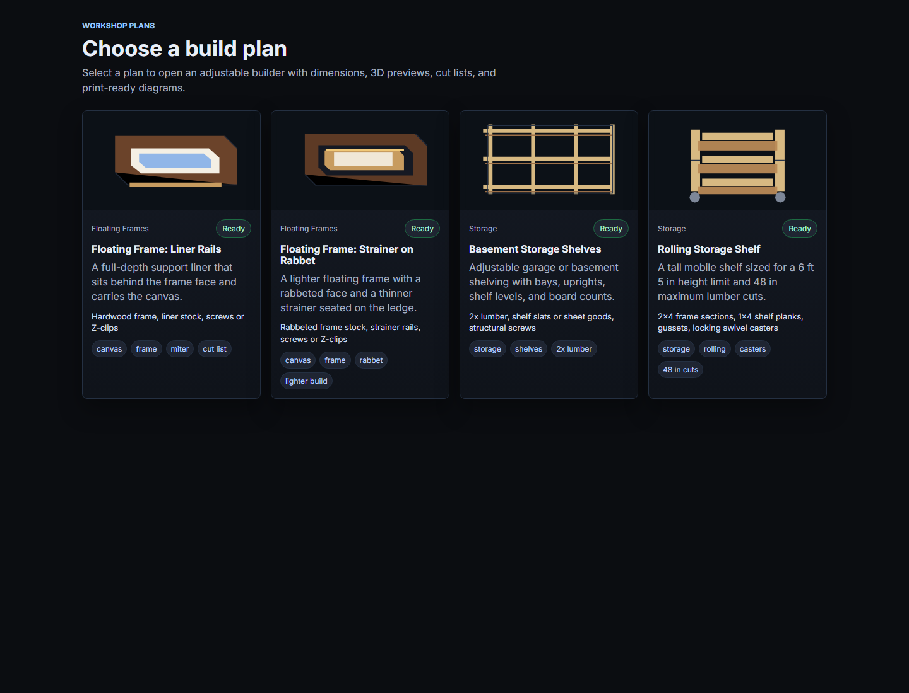
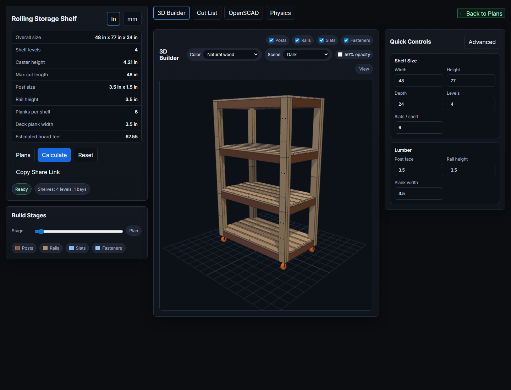

# Woodworking Plans

A no-build browser app for designing adjustable woodworking plans. It started as a floating frame planner and now includes a plan catalog for floating frames and storage shelves, with interactive dimensions, 3D previews, cut lists, OpenSCAD export, and a first-pass assembly/physics check.

Live site: [https://jim-kay.github.io/woodworking-plans/](https://jim-kay.github.io/woodworking-plans/)

## Screenshots





## Available Plans

- Floating Frame: Liner Rails
- Floating Frame: Strainer on Rabbet
- Basement Storage Shelves
- Rolling Storage Shelf

Each ready plan opens in the same builder UI and exposes the controls that matter for that project. Frame plans include canvas sizing, reveal, face width, depth, joinery, finish, and mounting settings. Shelf plans include width, height, depth, levels, bays, slats, and lumber sizing.

## Features

- Plan catalog with persisted "resume last plan" state.
- Inch and millimeter input/output modes.
- Three.js 3D builder with build-stage slider, visibility toggles, palette/scene controls, and camera presets.
- Cut lists with quantities, dimensions, notes, board-foot estimates, and purchase-board estimates.
- CSV export, clipboard copy, printable plan output, and share links encoded in the URL.
- OpenSCAD export for assembly-backed frame and shelf models.
- Physics diagnostic tab powered by Rapier loaded from a CDN.

## Run Locally

This project uses native ES modules and an import map, so open it through the local static server rather than directly from disk.

```sh
npm start
```

Then open:

```text
http://127.0.0.1:5173
```

The server defaults to port `5173`. You can override it with `PORT`:

```sh
PORT=8080 npm start
```

On Windows PowerShell:

```powershell
$env:PORT=8080; npm start
```

## Test

```sh
npm test
```

The current test suite covers frame math, mounting rules, formatting, stage labels, and shelf calculations.

## Project Structure

- `index.html` defines the plan catalog, builder layout, dialogs, tabs, and import map.
- `scripts/serve.mjs` runs the local no-cache static server.
- `src/app.js` wires the UI, plan selection, state persistence, share links, exports, printing, and tab rendering.
- `src/plans.js` defines the available plan catalog and default values for each plan.
- `src/catalogs.js` stores canvas presets, Z-clip data, and the base default plan.
- `src/frameMath.js` validates frame inputs and calculates frame dimensions, warnings, cut lists, board feet, mounting fit, and assembly data.
- `src/shelfMath.js` validates shelf inputs and calculates shelf dimensions, cut lists, board feet, assembly data, and construction warnings.
- `src/frameAssembly.js` and `src/assembly.js` build shared part/connection models for visualization, OpenSCAD, and physics checks.
- `src/viewer3d.js` owns the Three.js scene and renders the current assembly/build stage.
- `src/openScad.js` generates OpenSCAD models from supported plan assemblies.
- `src/physicsSim.js` runs the Rapier-based assembly diagnostic.
- `src/styles.css` contains the application styling.
- `tests/frameMath.test.mjs` contains the Node-based calculation tests.

## Runtime Notes

There is no bundler or package dependency install step for the app itself. Browser dependencies are loaded from CDNs:

- Three.js through the import map in `index.html`.
- Rapier only when the Physics tab diagnostic is run.

Because the app stores the last plan in `localStorage`, opening a fresh URL with no query string may resume the previous plan instead of showing the catalog.
