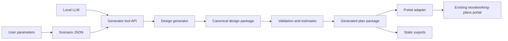

# Generator Architecture

## Goal

Add a design generation layer without throwing away the existing interactive portal.

The generator may live outside the browser app. It can be implemented in JavaScript, Python, C#, or another platform that can expose tools to a local model through MCP or a similar tool protocol.

## Recommended Architecture



## Why Keep The Generator Separate?

A separate generator can:

- run locally as a CLI or service
- expose MCP tools to a local LLM
- use Python or C# libraries when helpful
- run batch searches outside the browser
- save experiment records
- produce canonical design packages for the portal

The browser portal remains focused on interaction, inspection, and export.

## Initial Boundary

Start with files rather than live service calls:

```text
generated/
  simple-bird-feeder/
    scenario.json
    design.json
    validation.json
    estimates.json
    model.scad
```

Then add a browser-side loader or adapter that can consume `design.json`.

## Future MCP Tool Surface

A local model should not be asked to edit arbitrary source files for every design attempt. It should get tools such as:

```json
{
  "tool": "generate_design",
  "arguments": {
    "template_id": "tray_bird_feeder",
    "parameters": {
      "width_in": 12,
      "depth_in": 8,
      "side_height_in": 1.5
    }
  }
}
```

```json
{
  "tool": "validate_design",
  "arguments": {
    "design_id": "simple_bird_feeder_001"
  }
}
```

```json
{
  "tool": "export_plan_package",
  "arguments": {
    "design_id": "simple_bird_feeder_001",
    "formats": ["json", "openscad", "markdown"]
  }
}
```

The model should also be able to browse reusable design components before requesting new capabilities:

```json
{
  "tool": "search_components",
  "arguments": {
    "query": "wall mounted key hooks pilot holes"
  }
}
```

```json
{
  "tool": "get_component",
  "arguments": {
    "component_id": "hardware.linear_hook_array"
  }
}
```

Component IDs are stable and hierarchical, such as `geometry.rectangular_panel`, `hardware.wall_mount_hole_pair`, `patterns.centered_linear_spacing`, and `validators.edge_clearance`. Capability requests for new components should include the closest component IDs the model considered so Codex can extend the catalog without creating duplicates.

## Development Sequence

1. Define canonical generated-design JSON.
2. Implement one very small generator.
3. Write tests for part references and dimensions.
4. Export OpenSCAD from canonical data.
5. Adapt canonical data into the existing portal assembly shape.
6. Add a generated-design entry to the catalog.
7. Add local model tool calls after deterministic generation works.

## Platform Recommendation

For the first pass, use JavaScript modules in this repo because:

- the app already uses native ES modules
- tests already run through Node
- the existing viewer and OpenSCAD exporter are JavaScript
- a JS generator can share geometry utilities directly

Longer term, a Python or C# generator service is reasonable if it provides better libraries or cleaner MCP hosting. The canonical JSON package is what keeps that choice reversible.
