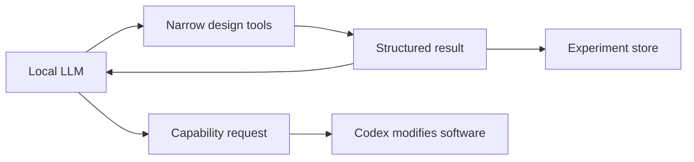

# Local LLM Tool Use

## Can A Local LLM Handle Tool Use?

Yes, but the answer depends on the model, runtime, and tool protocol.

Many locally runnable models can produce structured JSON tool calls when prompted or constrained. Some runtimes also support OpenAI-compatible tool calling or function-calling conventions. However, local tool use is usually less reliable than frontier hosted models unless the tools are narrow, well-documented, and validated strictly.

For this project, assume a local model can operate tools if:

- tool schemas are small and explicit
- arguments are validated
- failures return concise structured feedback
- the loop is allowed to retry
- tools are deterministic where possible
- dangerous operations are not exposed

## Good Local Model Tools

Good tools for this project:

- `list_templates`
- `generate_design`
- `validate_design`
- `simulate_design`
- `estimate_cost`
- `estimate_time`
- `export_openscad`
- `export_plan`
- `compare_designs`
- `summarize_failures`

Avoid exposing broad tools such as:

- arbitrary shell execution
- arbitrary filesystem writes
- direct source-code editing
- unconstrained network access

Codex can handle source-code changes when the local model discovers a capability gap.

## Recommended Loop



## Runtime Possibilities

Potential local inference runtimes include:

- llama.cpp server
- Ollama
- LM Studio
- vLLM where supported
- custom PyTorch runners

The best runtime can be chosen later. The immediate design requirement is to keep the generator accessible through structured tool calls and file-based design packages.

## Runtime Selection Strategy

Pick the runtime by what the design sandbox needs, not by popularity alone.

For the first local-model pass, prefer a host that provides:

- OpenAI-compatible chat endpoints
- structured JSON output or JSON-schema constrained generation
- tool/function-calling support
- model management that is easy to reproduce
- GPU acceleration on the target workstation
- enough logging to debug malformed tool calls

Practical starting points:

- **Ollama**: best first trial when setup speed matters. It supports local model management, tool calling, and structured outputs. Use it to prove the design loop quickly.
- **LM Studio**: good for interactive model exploration and an OpenAI-compatible local server. Use it when comparing models by hand or when a GUI helps inspect behavior.
- **llama.cpp server**: good when low-level control matters. It supports JSON-schema constrained sampling and OpenAI-style function calling with the right chat template flags.
- **vLLM**: good for higher-throughput serving and some model families with strong tool-calling support, but it is heavier operationally and may be less convenient on Windows.

Recommended evaluation order:

1. Start with Ollama or LM Studio to validate the sandbox contract.
2. Test two or three candidate models against the same scripted design tasks.
3. Score models on valid tool calls, useful revisions after validation feedback, and ability to produce a clear Codex capability request.
4. Move to llama.cpp server or vLLM only if the easier hosts block required tool-calling, context, performance, or reproducibility.

For this project, structured output reliability matters more than raw chat quality. A smaller model that reliably emits valid tool calls is more useful than a larger model that produces persuasive but invalid design JSON.

## Model Selection Strategy

Use separate model tiers rather than expecting one local model to do everything:

- **Fast iteration model**: a 7B/8B or efficient MoE model for cheap generate/validate/revise loops.
- **Planner model**: a stronger 14B-30B class model for interpreting validation failures and choosing next attempts.
- **Escalation summarizer**: any reliable structured-output model that can turn repeated failures into a concise Codex feature request.

Candidate families to test first:

- Qwen coder/instruct models with documented function-calling support.
- Mistral/Devstral coding models designed for agentic tool use.
- Llama-family instruct models where the selected runtime has a reliable tool-call template.

Do not choose solely from benchmark scores. Use a project-specific benchmark suite with tasks such as:

- generate a tray bird feeder scenario
- repair invalid dimensions after validator feedback
- avoid unsupported operations
- export a valid package
- request a missing capability when no available tool can complete the design

## Local Host Check And Benchmark

This repo includes two small Node scripts for local runtime evaluation:

```powershell
npm run llm:check
```

Checks for common local LLM commands and probes likely local endpoints:

- Ollama native: `http://localhost:11434/api/tags`
- Ollama OpenAI-compatible: `http://localhost:11434/v1/models`
- LM Studio: `http://localhost:1234/v1/models`
- vLLM: `http://localhost:8000/v1/models`
- llama.cpp server: `http://localhost:8080/v1/models`

```powershell
$env:LLM_BASE_URL = 'http://localhost:11434/v1'
$env:LLM_MODEL = 'model-name'
npm run llm:benchmark
```

The benchmark sends the same three structured-output tasks to any OpenAI-compatible local server:

- generate an initial tray bird feeder design action
- revise after validation feedback
- request a missing designer capability

The score is intentionally narrow. It measures whether the model can reliably pick the right sandbox action and emit parseable JSON for that action. It does not measure design quality by itself; deterministic validators and exported plan checks still make that decision.

The first deterministic sandbox tools are available through:

```powershell
npm run sandbox -- list_tools
npm run sandbox -- list_templates
npm run sandbox -- generate_design examples/tray-bird-feeder.scenario.json generated/runs/demo/design.json
npm run sandbox -- validate_design generated/runs/demo/design.json generated/runs/demo/validation.json
npm run sandbox -- export_plan_package generated/runs/demo/design.json generated/runs/demo/package
```

`list_tools` exposes the same tool manifest used by the local-model loop. The current agent-facing surface is:

- `inspect_scenario`
- `list_templates`
- `generate_design`
- `summarize_design`
- `validate_design`
- `revise_design`
- `annotate_design`
- `export_openscad`
- `check_publishability`
- `export_plan_package`
- `request_capability`

The intended model sequence is usually:

1. Inspect the scenario and tool surface.
2. Generate a design from the selected template.
3. Validate the generated design.
4. Revise if validation fails.
5. Use `annotate_design` when the design is structurally valid but needs better build guidance, drill instructions, labels, or part notes.
6. Check publishability.
7. Export a plan package, or request a missing capability from Codex.

Codex should generally improve prompts, tool schemas, validators, adapters, and portal support. The local model should make design-level choices through sandbox tools: dimensions, parameter revisions, build guidance, labels, notes, and missing-capability requests. If the model cannot express a desired improvement through the current tools, that is a signal for Codex to add a narrower tool rather than directly hardcoding the design improvement.

The first local-model loop runner uses the same tool surface:

```powershell
$env:LLM_BASE_URL = 'http://localhost:11434/v1'
$env:LLM_MODEL = 'qwen3:14b'
npm run sandbox:loop -- examples/tray-bird-feeder.scenario.json generated/runs/llm-demo
```

After a package is exported, run a role-based review pass:

```powershell
$env:LLM_BASE_URL = 'http://localhost:11434/v1'
$env:LLM_MODEL = 'qwen3:14b'
npm run sandbox:review -- generated/runs/llm-demo/package generated/runs/llm-demo/package-review.json
```

The review pass runs the package through focused roles:

- Parameter Reviewer
- Design Validator
- Build Planner
- Publication Reviewer
- Capability Scout

These are advisory review passes over the deterministic package. If validation and publishability pass, the reviewers should default to `ok_to_publish=true` and report model-only concerns as warnings, recommended revisions, or missing capabilities unless the package contains a direct contradiction.

## MCP Server

The sandbox dispatcher is also exposed as a small stdio MCP server:

```powershell
npm run sandbox:mcp -- examples/tray-bird-feeder.scenario.json
```

The server supports the standard JSON-RPC MCP methods needed for tool use:

- `initialize`
- `tools/list`
- `tools/call`

It keeps design state for the life of the process. A client can call `generate_design`, then `validate_design`, then `export_plan_package` without resending the generated design on each turn. Start the server with a scenario path, or set `SANDBOX_SCENARIO_PATH` when launching it from a client configuration.

The MCP server is intentionally dependency-free and wraps the same `executeSandboxTool(...)` dispatcher used by the CLI and local Qwen loop. That keeps CLI, scripted model loop, and future agent integrations on one tool contract.

The loop runner writes:

- `scenario.json`
- `design.json`
- `validation.json`
- `transcript.json`
- `summary.txt`
- `package/` with `design.json`, `validation.json`, `portal-result.json`, `publishability.json`, and `model.scad`

Generated run outputs are intentionally ignored by git under `generated/runs/`.

## Current Workstation Baseline

Initial local check on this workstation:

- OS: Windows 11 Pro
- GPU: NVIDIA GeForce RTX 5060 Ti, about 16 GB VRAM
- System RAM: about 34 GB
- Installed host: Ollama 0.30.6
- Pulled models: `qwen3:8b`, `qwen3:14b`

Initial benchmark, 8B baseline:

```text
LLM_BASE_URL=http://localhost:11434/v1
LLM_MODEL=qwen3:8b
npm run llm:benchmark
```

Result:

- Score: 3/3
- Warm quality notes: generation action used string values for dimensions, so downstream tools should coerce or reject invalid argument types.
- Generate initial design action: pass
- Revise after validation action: pass
- Request missing capability action: pass
- Cold first response: about 50 seconds
- Warm follow-up responses: about 4-6 seconds

Second benchmark, 14B comparison:

```text
LLM_BASE_URL=http://localhost:11434/v1
LLM_MODEL=qwen3:14b
npm run llm:benchmark
```

Result:

- Score: 3/3
- Warm quality notes: no benchmark warnings; generation action used numeric dimensions and explicit features.
- Generate initial design action: pass
- Revise after validation action: pass
- Request missing capability action: pass
- Cold first response: about 24 seconds
- Warm follow-up responses: about 7-9 seconds
- Generated cleaner numeric arguments than the 8B run in the first design action.

Current recommendation:

- Use `qwen3:14b` as the default sandbox planner while the deterministic design tools are being built.
- Keep `qwen3:8b` as the fast fallback for smoke tests and quick iteration.
- Re-run this benchmark after the real sandbox tools exist, then add tests with actual validator feedback and exported design packages before treating any model as final.

## Practical Reliability Strategy

Treat local model output as proposals, not truth.

Every proposed design should pass:

- JSON schema validation
- geometry validation
- construction validation
- model export validation
- cost/time sanity checks

If the local model produces invalid tool arguments, the tool should return a compact correction message rather than failing silently.

## MCP Implication

If the generator is implemented as an MCP server, a local model-capable agent can call it through a standard tool surface. The server can be written in any language with MCP support or an MCP wrapper.

For early development, a CLI/file contract is enough. MCP can wrap the same commands after the contracts stabilize.
