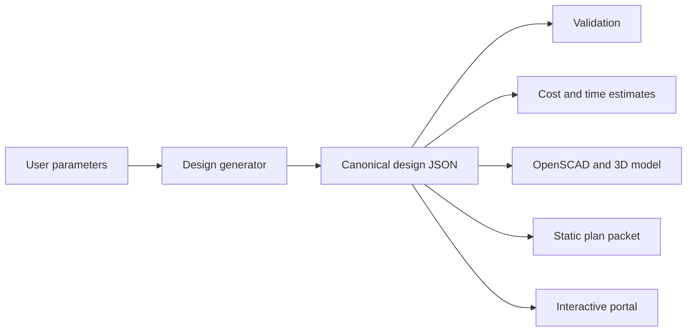

# Product Paths

## Overview

The system can produce value in two complementary ways:

- Static plan packets
- Interactive parametric portal

Both should be generated from the same canonical design representation.

## Path A: Static Plan Packets

Static packets are downloadable artifacts similar to high-quality blueprint products.

Typical contents:

- PDF or printable HTML plan
- Markdown source plan
- OpenSCAD model
- PNG diagrams
- Cut list
- Bill of materials
- Cost and time estimates
- JSON design package

Strengths:

- Easy to sell or share.
- Works offline.
- Familiar to builders.
- Simple fulfillment model.
- Good for marketplace products.

Limitations:

- Less exploratory.
- Customization happens before export.
- Users cannot easily inspect alternate build stages unless those diagrams are included.

## Path B: Interactive Parametric Portal

The portal lets users interact with a selected plan before committing to a final export.

Capabilities:

- Enter dimensions directly.
- Adjust parameter controls such as shelf count, total width, height, depth, material profile, and tool availability.
- See immediate recalculation.
- Inspect the 3D model in a viewer.
- Move through build stages.
- Show exploded views or per-step assembly states.
- Review warnings as parameters change.
- Export static plans once the design is satisfactory.

Strengths:

- Better for customization.
- Helps users understand the design before building.
- Makes parametric value obvious.
- Can validate user-entered dimensions immediately.
- Can support saved designs, share links, and future community templates.

Limitations:

- More software to maintain.
- Needs careful UX around invalid parameter combinations.
- Requires a clean separation between design logic and presentation.
- Marketplace delivery is less straightforward unless paired with static exports.

## Shared Core Requirement

The static and portal paths should share:

- Design schema
- Material catalog
- Part generator
- Validation engine
- Cost estimator
- Time estimator
- Assembly step model
- OpenSCAD/model exporter

This prevents two versions of the truth.

## Recommended Strategy

Build the canonical generation engine first, then use it to feed both outputs:

## Product Sequencing

Recommended sequence:

1. Static MVP with generated plan data and OpenSCAD.
2. Portal integration using the same generated design data.
3. Shareable parametric URLs.
4. Saved user projects.
5. Marketplace-ready static exports from portal state.

This keeps the core generator honest while still moving toward the richer interactive experience.

