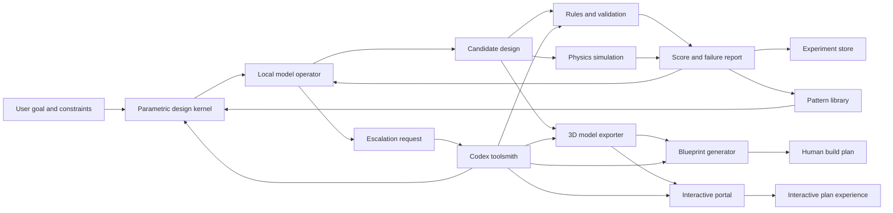

# System Architecture

## Components

### 1. Parametric Design Kernel

Owns the abstract design definition:

- Parameters
- Derived dimensions
- Parts
- Materials
- Joints
- Constraints
- Assembly steps
- Validation requirements

The design kernel should be deterministic and serializable.

### 2. Simulation Engine

Evaluates whether a generated design behaves plausibly under physical forces.

Initial implementation can use CPU physics. CUDA becomes useful for batched simulation, GPU inference, neural optimizers, or future custom kernels.

### 3. Rules And Validation Engine

Checks buildability and common construction constraints:

- Minimum screw edge distance
- Maximum unsupported span
- Material thickness limits
- Standard stock dimensions
- Tool feasibility
- Assembly access
- Part collision
- Stability margin

Rules should be explicit and inspectable so the local model can learn from failures.

### 4. Local Model Operator

Runs locally and proposes:

- New designs
- Parameter changes
- Assembly sequences
- Design repairs
- Search strategies
- New pattern hypotheses

The local model should operate through structured tools rather than uncontrolled free text.

### 5. Codex Toolsmith

Codex is responsible for modifying the system itself:

- Adding new design primitives
- Adding validators
- Fixing simulation bugs
- Improving APIs
- Adding export formats
- Adding visualization
- Adding benchmark scenarios

Codex is called selectively when the local loop reaches a capability boundary.

### 6. Pattern Library

Stores successful parametric design families and reusable subassemblies:

- Shelf side frame
- Box carcass
- Leg-and-rail table frame
- Cross brace
- Gusset
- Drawer-like sliding bin support

Each pattern should include parameters, constraints, validation history, and example generated plans.

### 7. Blueprint Generator

Converts a validated design into human-facing artifacts:

- OpenSCAD or other 3D model exports
- Renderings
- Exploded views
- Assembly diagrams
- Cut diagrams
- Instruction text
- Materials list
- Cost estimate
- Time estimate

### 8. Interactive Portal

Presents the same validated design as an explorable web experience:

- Parametric input controls
- Immediate recalculation
- 3D model viewer
- Build-stage slider
- Exploded and step views
- Cut list and bill of materials tabs
- OpenSCAD and plan export actions

The portal should consume canonical design data and generated template definitions rather than requiring every plan to be hand-coded.

### 9. Model Exporter

Converts the canonical design into inspectable 3D artifacts:

- OpenSCAD source
- STL or mesh exports where useful
- GLTF or web-preview geometry where useful
- Render snapshots for visual regression checks

The exporter should be generated from the same design data as the cut list and assembly steps, so mismatches can be detected.

### 10. Experiment Store

Persists every trial:

- Prompt or goal
- Parameters
- Generated design JSON
- Validation results
- Simulation traces
- Score
- Failure mode
- Model notes
- Reproducibility metadata

This creates a feedback archive for future search and model improvement.

## Data Flow

## CUDA Usage

CUDA is not required for the first version of every component, but it can accelerate:

- Local LLM inference
- Embedding search over successful designs
- Batch physics trials
- Monte Carlo force perturbations
- Training small specialist models
- GPU rendering or diagram generation pipelines

Use CUDA when profiling shows the bottleneck or when a local model needs GPU inference.
